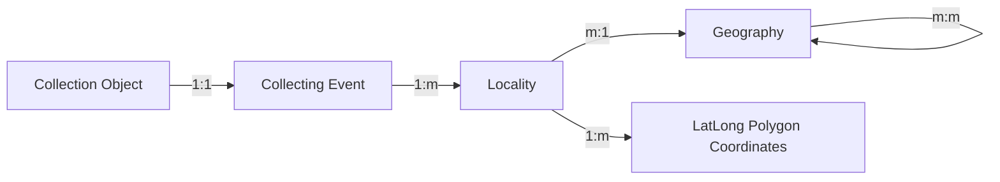

The Beaty's data is published through the [Global Biodiversity Information Facililty (GBIF)](https://gbif.org/). GBIF adheres to a data standard called [Darwin Core](https://dwc.tdwg.org/). Data standards are usually maintained by working groups, non-profits, or other organizations to ensure that everyone who publishes data follows the same schema for their data model. The standard will usually include a [JSON-like](https://en.wikipedia.org/wiki/JSON) specification for the fields, data types, and relationships between data objects. Data standards ensure interoperability beteen datasets, and sometimes can be extended or adapted.

Continuing our discussion of data modelling, we will discuss data standards, and how they can be used to model your data. We will learn how to look up and make sense of data standards, how they are typically packaged and distributed, and how to convert between standards. Attendees will learn not just about Darwin Core, but also other data standards that are used in daily life and at the Beaty. This will help with challenges you may be having converting between Specify and Darwin Core, or other systems that use different schemas.

## Notes
### Beaty Schemas
- [database.beatymuseum.ubc.ca/specify/data-model](https://database.beatymuseum.ubc.ca/specify/data-model)
- [gbif.org](https://gbif.org/)

### Locations standards and resources
The part of the Beaty locality data model looks like this:

You can find this out by tracing the data model for locality here: [database.beatymuseum.ubc.ca/specify/data-model/#locality](https://database.beatymuseum.ubc.ca/specify/data-model/#locality).

Location data is difficult to manage, and there different standards for it depending on what aspect of location data that you're modelling:

- [geojson.org](https://geojson.org/)
- [ogc.org/standards](https://www.ogc.org/standards/)

There are also different databases that allow you to disambiguate location names, and look up corresponding lat-longs and other important geographical data:

- [atlas.gc.ca/toporama](https://atlas.gc.ca/toporama/en/index.html)