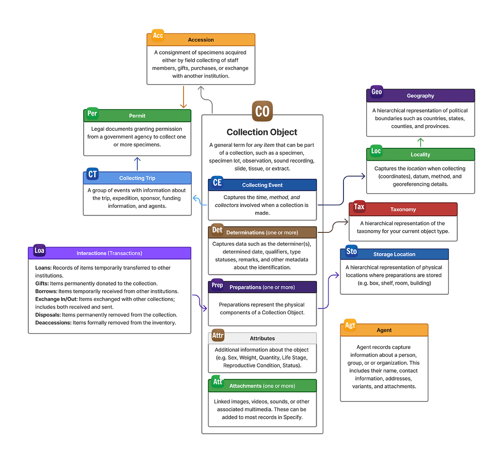
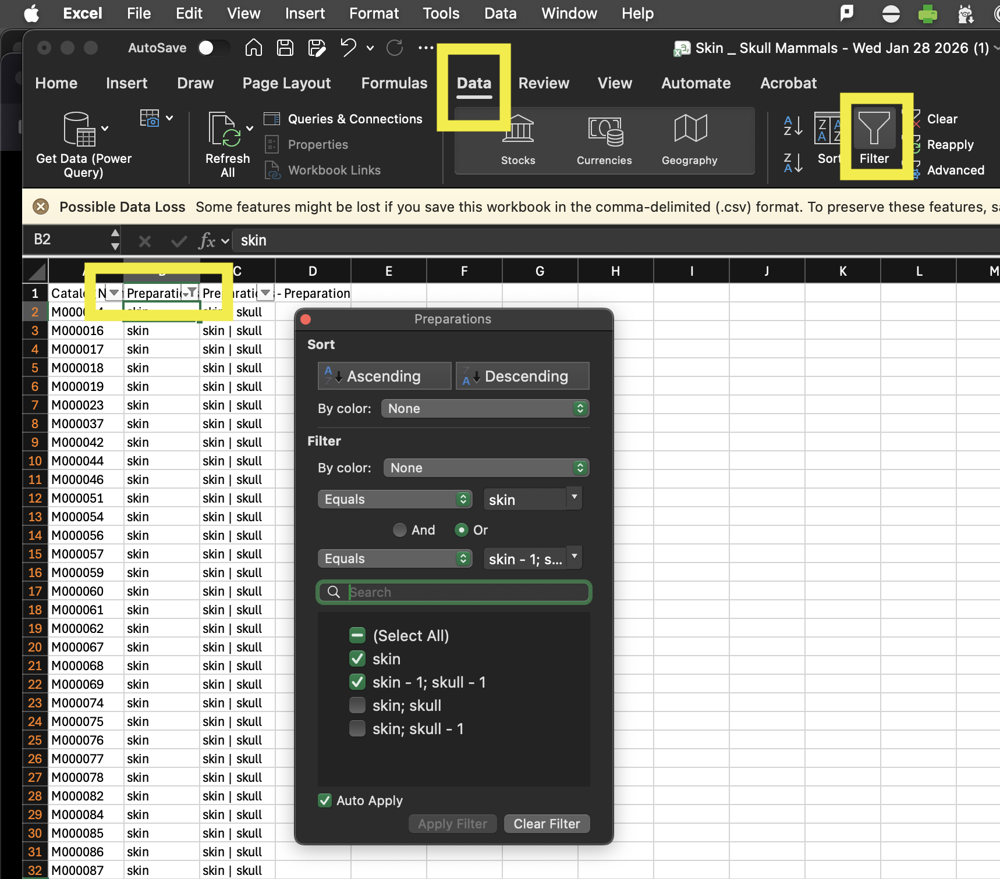
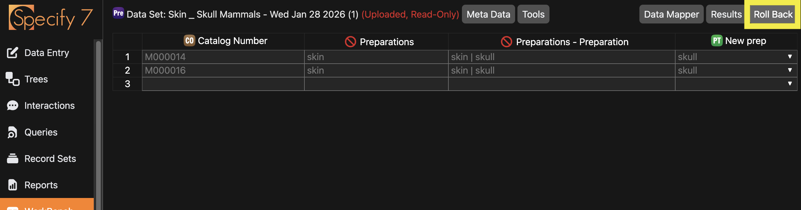

# Data Cleaning
Data cleaning is the process of transforming data into
regular, structured, usable, trustable formats.

---
# Setting expectations
Data is never clean...even after you clean it! Do not expect perfection.
Instead, we *manage* data cleanliness. 
99% perfect is close enough. 
Getting another 99% of that last 1% is amazing.
If you wanted to be exactly perfect, that would be your full time job.

---
# Target a table

---
# Make a query

---
# Download a CSV

---
# Inspect and filter your data

---
# Edit and Inspect

---
# Create a sample

---
# Import data to Workbench

---
# Map edits and save upload plan

---
# Validate and upload

---
# Verify through original query

---
# Rollback (if you want) and repeat for full set

