# Image Segmentation
Digitization at the Beaty often just means inputing text and numerical data to create a record. The goal is to get all of our specimens not only recorded but imaged.

Today we'll talk about imaging and how AI can use images to support databasing.

---
## Imaging at the Beaty
Imaging at the Beaty can mean lots of different things. There are many processes and considerations:
- Camera type and setup
- Lighting type and setup
- Staging (fixtures, color correction, measurement, etc.)
- Object standardization and prep
- Object size and dimensions
- Object movement and indexing

---
## Setup for Vascular and Algae
Here is an example of the Vascular and Algae imaging setup.
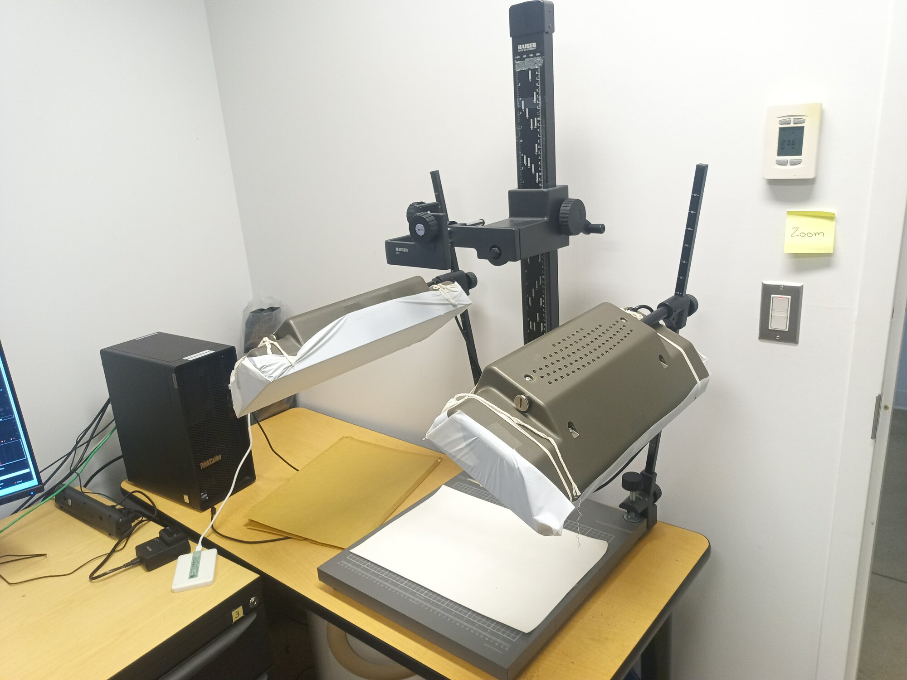 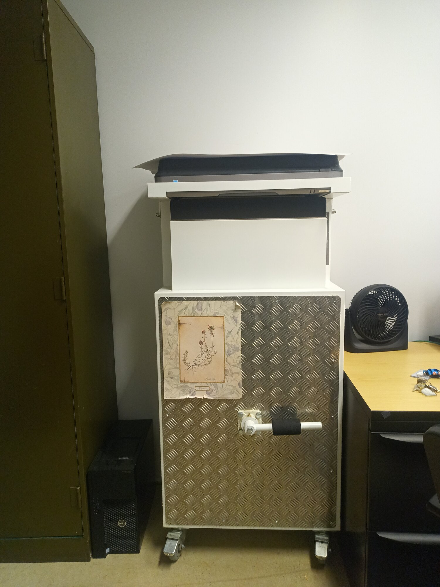

---
## Setup for Bryophytes
Here is an example of the Bryophytes imaging setup.
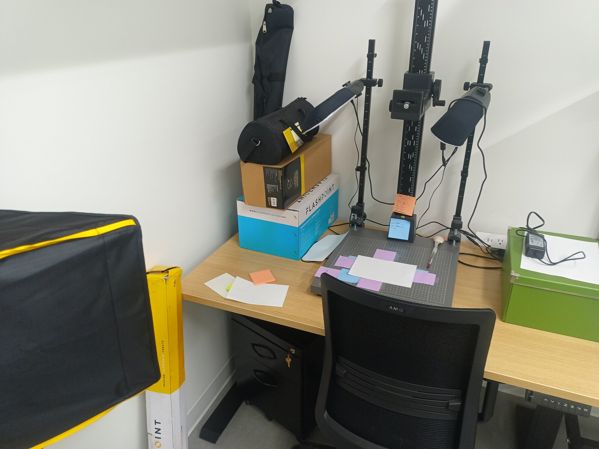 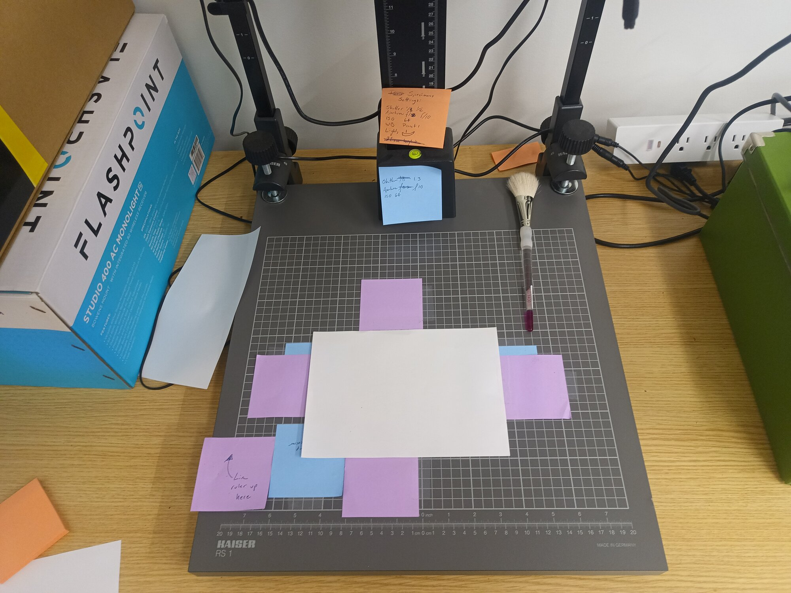

---
## Microscopy
Entomology uses a microscope as a camera with a light ring (image similar but not exact):
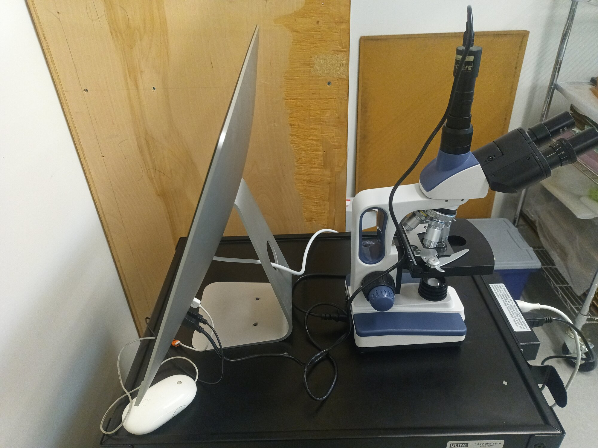

---
## 3D Imaging
Tetrapods are starting to make use of 3D imaging with combined laser and RGB setups and turntable autoindexing:
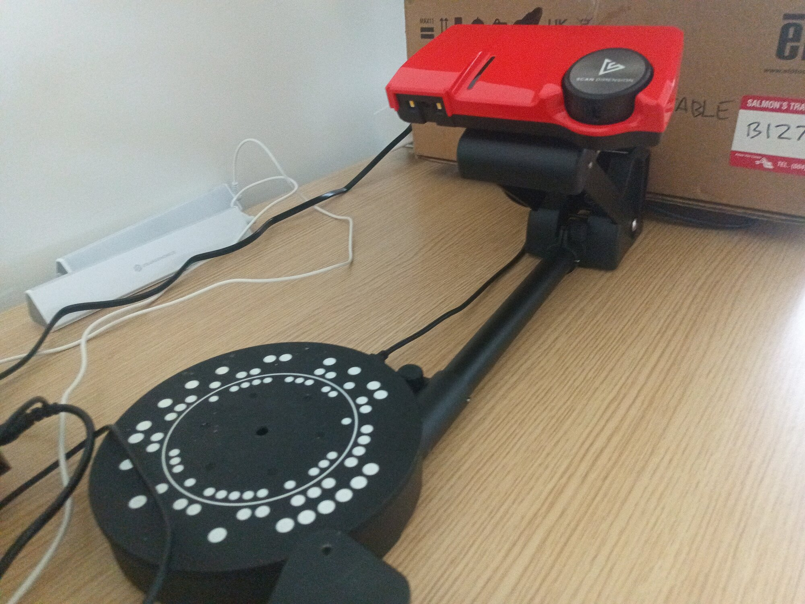

---
## Indexing and Fixtures
Setups usually require staging 
elements to index color and measurements.

---
## Standarization and Prep
Some collections have standard sheet or package sizes:
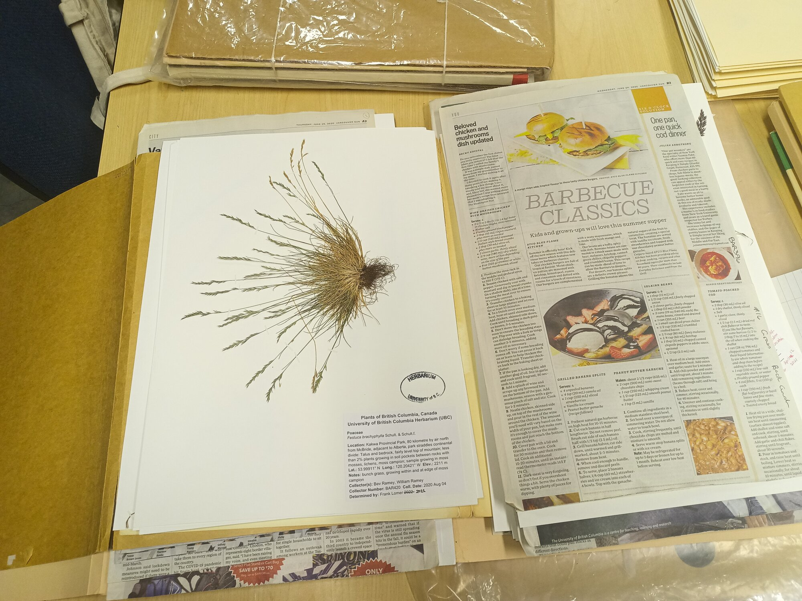 
But some do not, since their specimens might be of any size.

---
## Image Concepts: RGB
Most images are RGB raster images. That means that each pixel includes brightness values for `Red`, `Green`, and `Blue` LEDs that make up your screen.

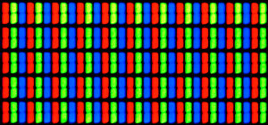 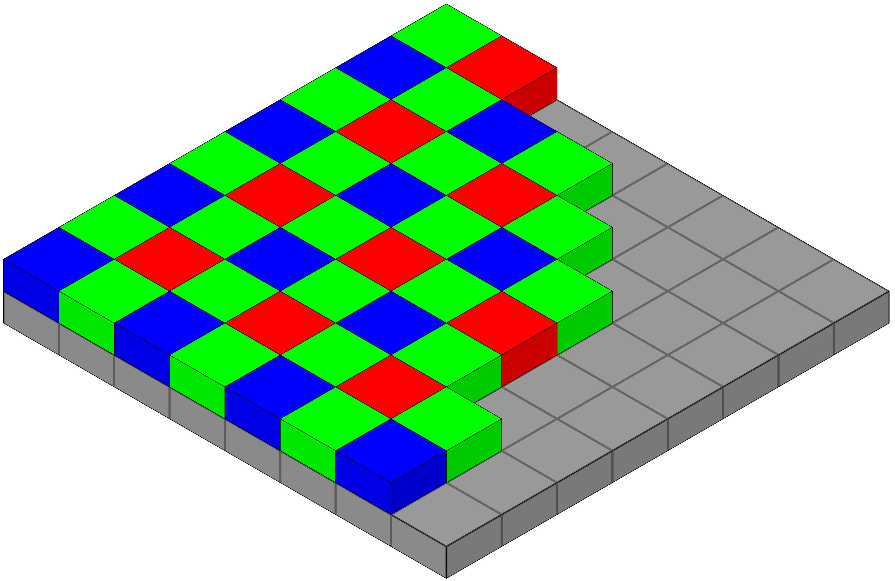 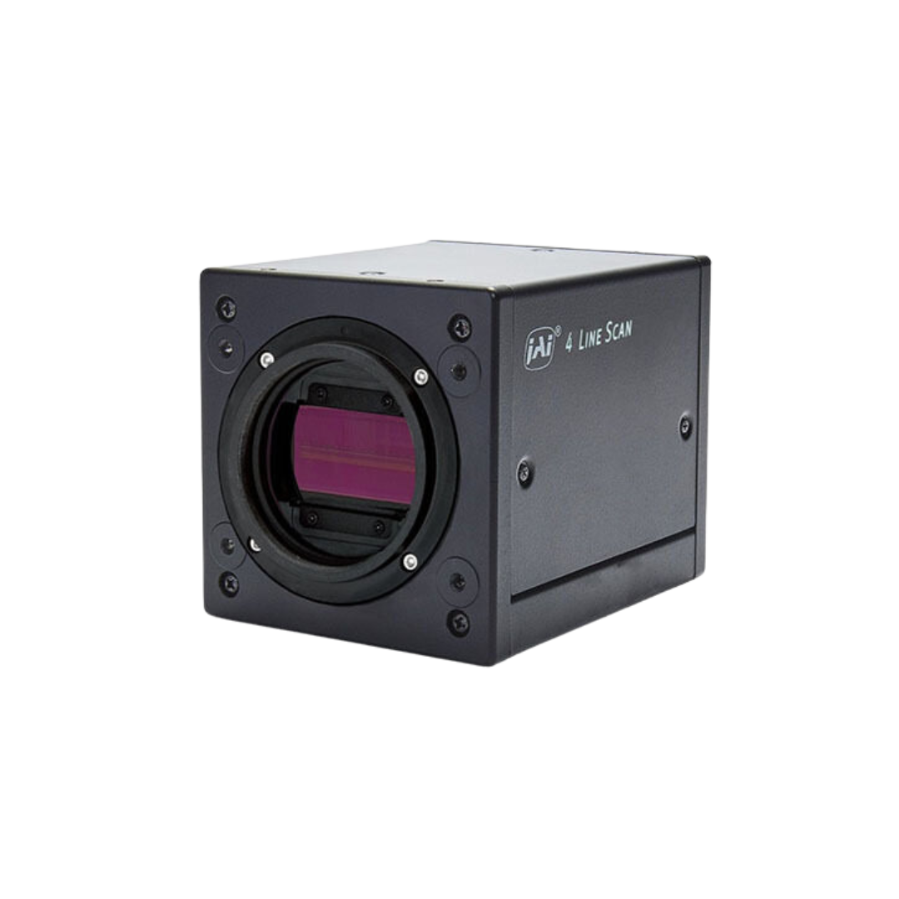 

---
## Image Concepts: Depth Map
Some images are depth maps where pixel brightness corresponds to a distance from the camera.
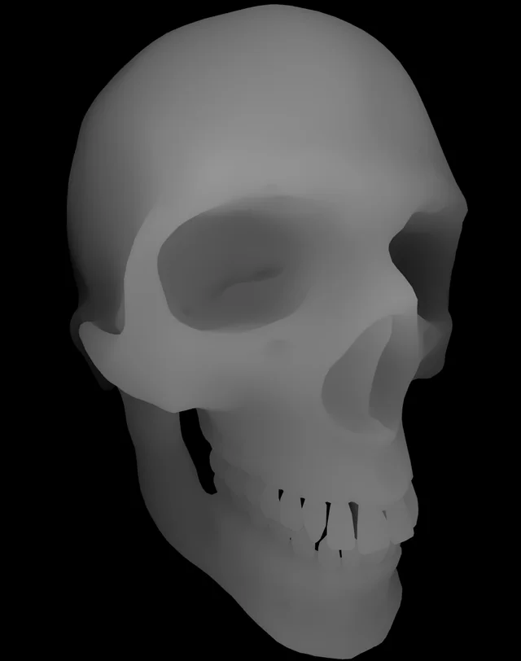  

---
## Image Concepts: Complex Imaging
Some imaging processes, like RTI, take tens or hundreds of images to be interactively reconstructed later.

https://vcg.isti.cnr.it/~palma/webrtiviewer/viewercoin.html

By the way, I want one of these domes! https://www.rti-dome.com/

---
## Image Processing
With AI, we can now label sections of an image easily. Using a simple prompt like `"plant specimen"` or `label` we can get the following:

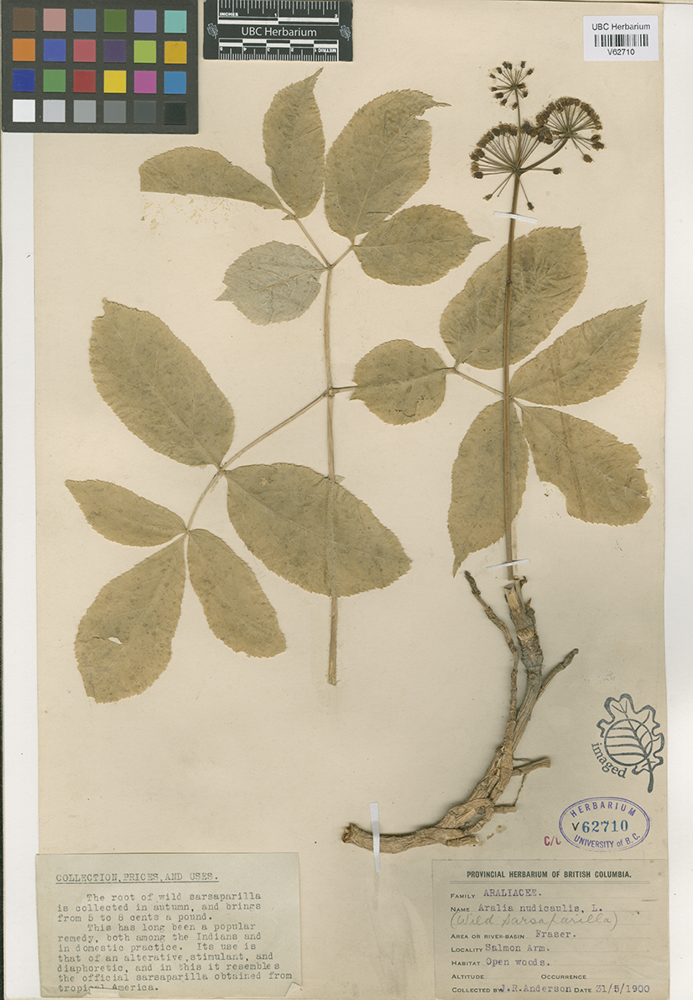  

---
## Demo
