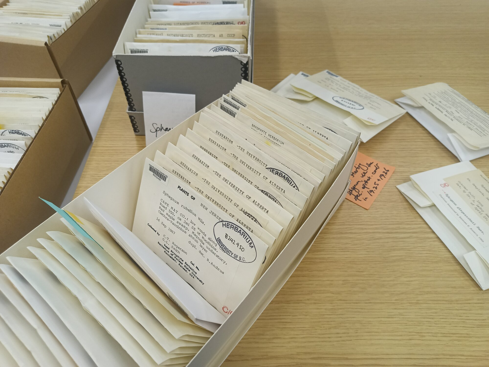
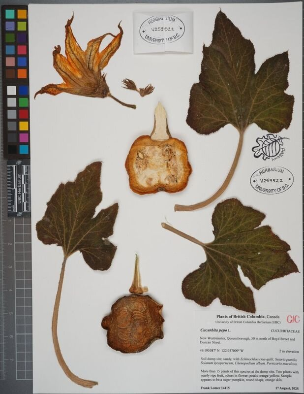
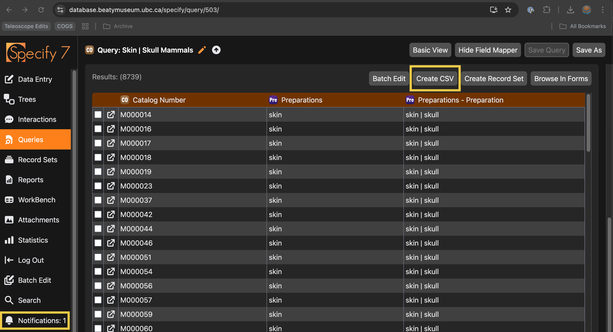

# Labels
Many people need to print labels at the Beaty. I've developed a system for designing labels, available now at:

[apps.beatymuseum.ubc.ca/labels](https://apps.beatymuseum.ubc.ca/labels)

Today, I will motivate the system, demo it, and run a tutorial.

---
## Why care about labels?
Labels are used all over the museum.

---
## Label Design Considerations
Labels have different material considerations:
1. Size of print
2. Paper stock
3. One- or two-sided

---
## Label Design Considerations
Labels have different process considerations:
1. Who prints the labels and how often?
2. How are the labels assembled and processed?
3. How do we get the data from Specify into a label template?

---
## Specify System
Specify uses a layout engine called "JasperSoft" which is a dedicated business report creation software.

---
## Jaspersoft issues
Jaspersoft is powerful, but complex. Many Beaty users reported being able to use it effectively.

---
## First Pass: InDesign Data Merge
Last year, I built a label creation system for Karen G.'s team using InDesign. When I first worked at the Beaty, I used this to make hundreds of labels.

---
## First Pass: InDesign Data Merge
However, InDesign is expensive. So Linda asked me to come up with a system that would work for less money.

---
## Requirements: Web App
A web application for automatic label generation would help the Herbarium offload design work to collectors. Alternatively, it could be used internally by museum staff.

---
## Requirements: Expressive and Minimal
Using CSV/XLSX as exchange formats, the system needed to do basic layout, but not be a full design program. Importantly, the data merge logic needed to be robust.

E.g., conditionals like:

`If "variety" column has data, print "var."`

---
## Demo: Prepping Data
Create a query with all of the columns you would like to appear on your label.

E.g., you can go to the following example:

[database.beatymuseum.ubc.ca/specify/query/625/](https://database.beatymuseum.ubc.ca/specify/query/625/)

---
## Demo: Downloading Data
Click `Query` and then `Create CSV`:

