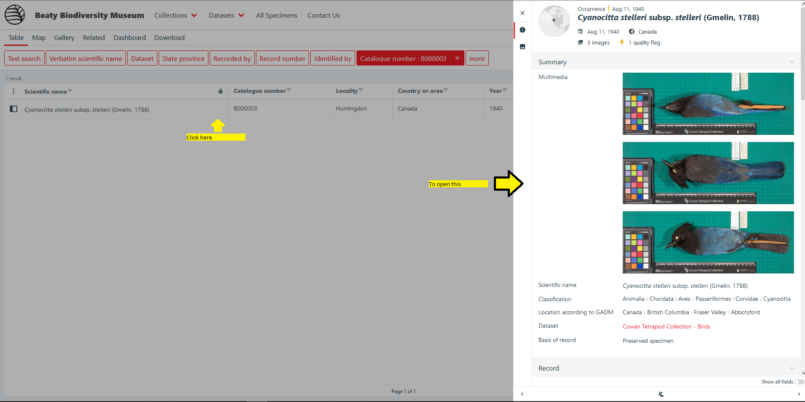
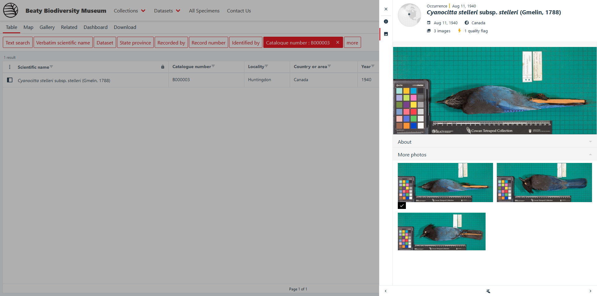
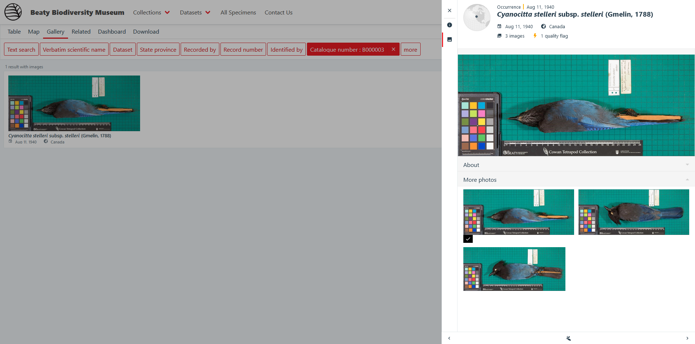

# Download images from the data portal

Images are not hosted on the portal itself, rather sourced from the CDN. Downloading an image to your computer is as simple as opening the image by clicking on the image link, and saving the image from your browser. Below are the steps in detail:

!!! note "Bulk downloading images"

    We are exploring ways to make it easier to download many images in bulk. Until then, if you have a large amount of images that you would like download, please contact the respective collection curator to start a specialized request.

=== "From the TABLE view"

    ## Open the occurrence associated with the image you want to download

    All images are associated with an occurrence. For example, [B000003](https://collections.beatymuseum.ubc.ca/specimen/search?catalogNumber=B000003&entity=1291974418) has three images associated with it. To open the details for an occurrence, click on the corresponding row to open the details panel.

    <figure markdown>
    
    <figcaption>Opening the occurrence panel for a record</figcaption>
    </figure>

    ## Select the image you wish to download

    Next, click on the image you wish to download. After clicking on the image, the occurrences panel will switch to the image view, and the image you clicked will be enlarged. 

    <figure markdown>
    
    <figcaption>The images view of the occurrence panel</figcaption>
    </figure>

    Select `About`. This will open up a table that lists three values

    | About | |
    | ----- | -- |
    | Type | StillImage |
    | Format | image/jpeg |
    | Identifier | https://beaty.b-cdn.net/B000003a.jpg |

    Click on the link listed in the `Identifier` row. This is the path to locate the image on the CDN. The image will open in the browser.

    ## Save the image from the CDN

    With the large image now open in your browser, ++right-button++ mouse click and select "Save Image as" or ++ctrl++ + ++s++ to save the image. This will open up your computer's file browser and ask where you would like to save the image.

    !!! tip

        If you have done the steps correctly, the image size should be around 600KB to 1.2MB. If the image size is lower than 100KB, it is likely that you have downloaded a smaller image size from another part of the system.

=== "From the GALLERY view"

    ## Open the occurrence associated with the image you want to download

    All images are associated with an occurrence. For example, [B000003](https://collections.beatymuseum.ubc.ca/specimen/search?catalogNumber=B000003&entity=1291974418) has three images associated with it. To open the details for an occurrence, click on the corresponding image to open the details panel.

    <figure markdown>
    
    <figcaption>Opening the occurrence panel for a record from gallery view</figcaption>
    </figure>

    ## Open the details for the image you wish to download

    Select `About`. This will open up a table that lists three values

    | About | |
    | ----- | -- |
    | Type | StillImage |
    | Format | image/jpeg |
    | Identifier | https://beaty.b-cdn.net/B000003a.jpg |

    Click on the link listed in the `Identifier` row. This is the path to locate the image on the CDN. The image will open in the browser.

    ## Save the image from the CDN

    With the large image now open in your browser, ++right-button++ mouse click and select "Save Image as" or ++ctrl++ + ++s++ to save the image. This will open up your computer's file browser and ask where you would like to save the image.

    !!! tip

        If you have done the steps correctly, the image size should be around 600KB to 1.2MB. If the image size is lower than 100KB, it is likely that you have downloaded a smaller image size from another part of the system.

*[CDN]: Content Delivery Network 