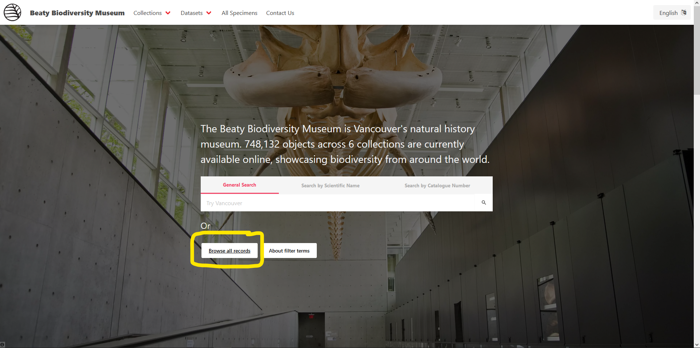
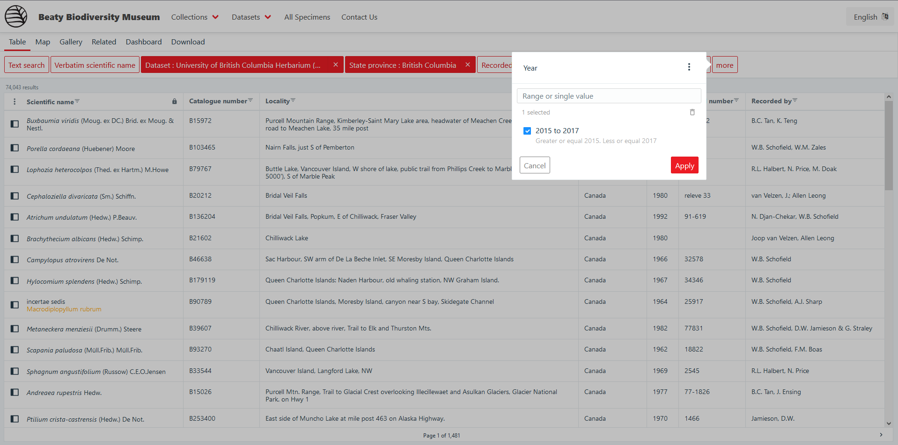
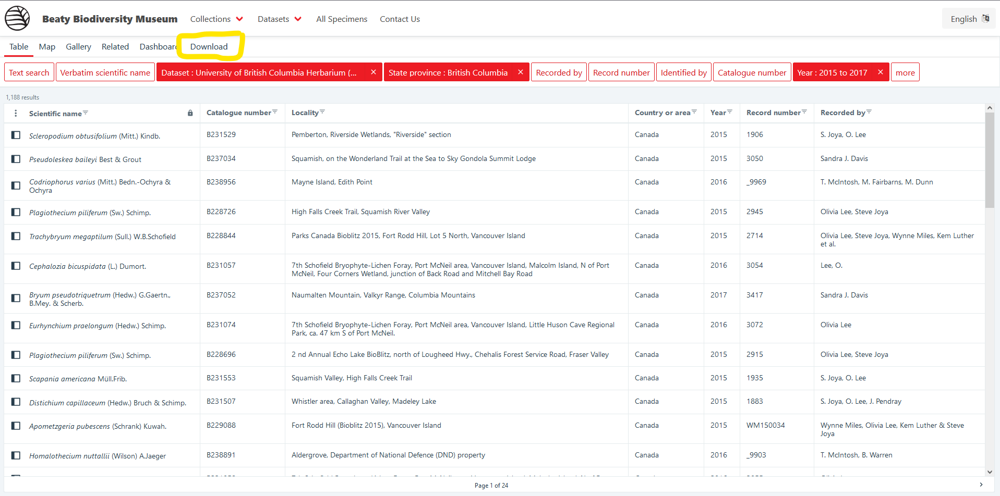
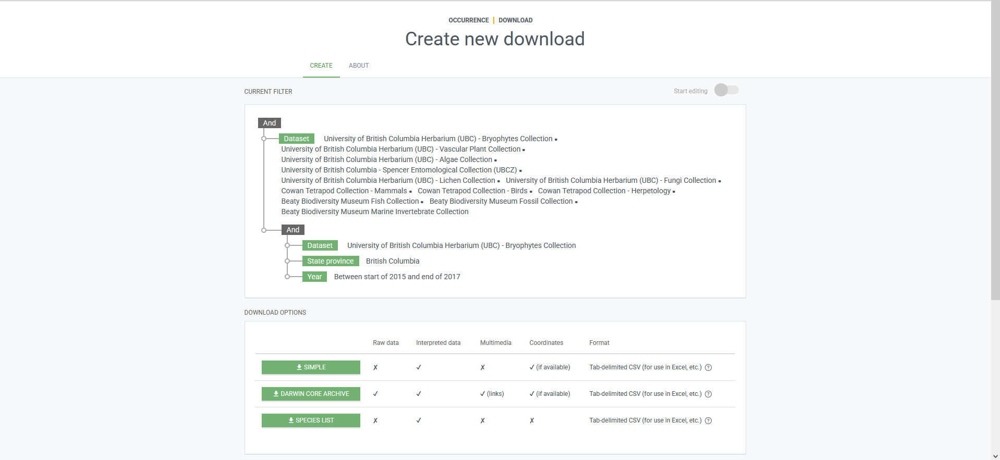

# Downloading data

You may wish to download data to analyze it in excel or via your favourite programming language. Downloading data also generates a DOI which [should be used to cite the data if you use the data for a publication](https://www.gbif.org/citation-guidelines). Citing datasets helps recognize the work that scientists did to produce and curate the data for use.

The best way to download data is to narrow down the data you wish to use through filters, and then pressing the `Download` button. This will assemble a derived dataset with just the records you need, and create a DOI that is specific to the time that you downloaded it. Depending on the size of your download request, it may take some time to get ready. A notification will be sent to the email you register with GBIF when the download is ready.

*[DOI]: Digital Object Identifier

## Example

For this example, data will be downloaded from the Bryophytes dataset. The records downloaded will be located in British Columbia, and collected between the years 2015 and 2017.

### Filtering data based on criteria

For this operation, three filters in total need to be applied.

1. Records within Bryophytes
2. Records from British Columbia
3. Records collected between the years 2015 and 2017

This tutorial will assume that you are starting from viewing all the records from the museum, to show how all three of the above can be applied from that interface. There are other ways to do the same operations, including selecting `Bryophytes` from within the navigation menu.

**Step 1: Select `Browse all records` from the homepage**

<figure markdown>
  
  <figcaption>Browse all records from the homepage</figcaption>
</figure>

**Step 2: Apply the desired filters**

The first filter to apply is to narrow the results to the Bryophytes. To do this, select `Dataset` and begin typing "Bryophytes", after a few characters, there should only be one option presented - `University of British Columbia Herbarium (UBC) - Bryophytes`. Click on this option, and then click apply. The number of results should drop from somewhere in the 700,000's to the 200,000's.

Next, the filter for British Columbia can be applied. To apply this filter, select `State province` from the filter bar, and type `British Columbia`.

Lastly, for the filter on collection year, select `More` and then click `Year`. The filters under `More` are organized alphabetically, so it will be at the bottom of the list. Once `Year` has been selected, enter `2015,2017` to denote the range of years. The interface should display "Greater or equal to 2015, Less than or equal 2017" if entered correctly.

<figure markdown>
  
  <figcaption>Filtering for Bryophytes from British Columbia collected between 2015 and 2017</figcaption>
</figure>

### Downloading the filtered data

Now that the records are filtered, they can be downloaded. To download the records, press `Download` in the navigation bar.

<figure markdown>
  
  <figcaption>Downloading records once filtered</figcaption>
</figure>

There will be a dialog that states that you will be redirected to `gbif.org` and that an account is required to download the content. Click `Continue` to be taken `gbif.org` to download the records.

Once on GBIF, you will see a page that looks similar to the screenshot below. 

<figure markdown>
  
  <figcaption>Downloading records from GBIF</figcaption>
</figure>

In the top dialog, you can see the three filters previously applied. However, it may be unclear why there is an additional filter for other datasets. This is an automatic filter that is applied to any downloads coming from the Beaty Biodiversity Museum website, and filters for records within the museum (we have a lot of collections!). It is safe to ignore, and won't affect the download in any way.

!!! question "Why is an account required for downloading data?"

    Having to create an account can be a hassle, however it does enable us to do a few things that we otherwise wouldn't be able to do.

    1. In previous download systems, limits have been necessary to prevent system abuse. From GBIF with an account, there are no limits, you may download hundreds of thousands of records if you like, even the entirety of the museum.
    2. As these larger downloads can sometimes take some time to prepare, an account allows an email to be sent to you when the download is ready, rather than having to keep the webpage open.
    3. If you wish to use the data for a publication, a DOI will be generated for the download, allowing you to easily have a consistent dataset to work with for your research.
