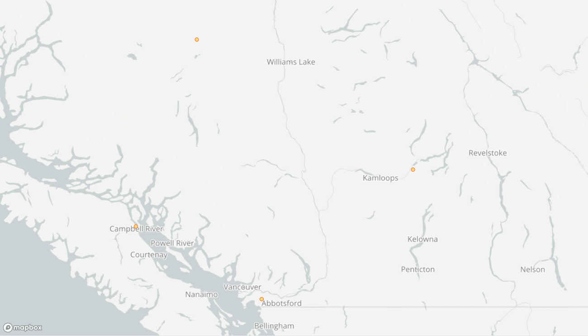
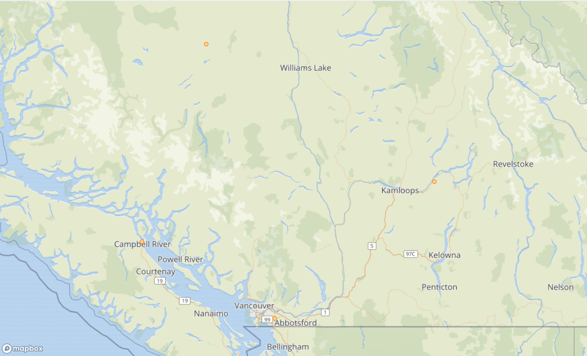

# Viewing data

There are many different ways to view data on the portal.

- As a table (Table)
- On a map (Map)
- As an image grid (Gallery)
- As a mindmap of related records (Related)
- Through custom dashboards (Dashboard)

Each of these views can be accessed through the tabs directly under the navigation menu.

<figure markdown>
  
  <figcaption>Tabs to use to select different views</figcaption>
</figure>

As the table view is mostly covered in [Searching for specimens on the portal](searching.md) we won't cover that here. Instead we will cover the unique functionality of each of the other view options.

## Map view

For this example, we will use some records of `Vulpes vulpes` in British Columbia. 

### Changing the colour scheme

Our first option is change the colour of the map. There are 4 options to pick from (sometimes less depending on which projection is selected). These can be selected by pressing the :material-layers-outline: icon in the top right of the map view. Satellite is not shown because it is not recommended, as it takes a long time to load.

-   <figure markdown>
    
    <figcaption>Bright</figcaption>
    </figure>
-   <figure markdown>
    
    <figcaption>Nature</figcaption>
    </figure>
-   <figure markdown>
    
    <figcaption>Dark</figcaption>
    </figure>

### Changing the projection

The projection can be changed by pressing the :octicons-globe-16: icon in the top right of the map view. There are four options to pick from.