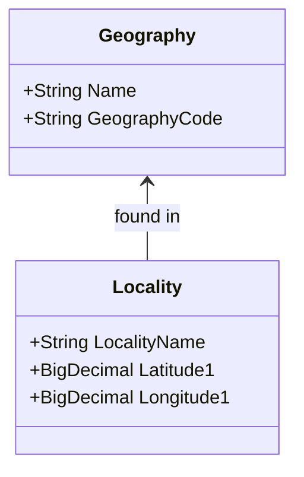
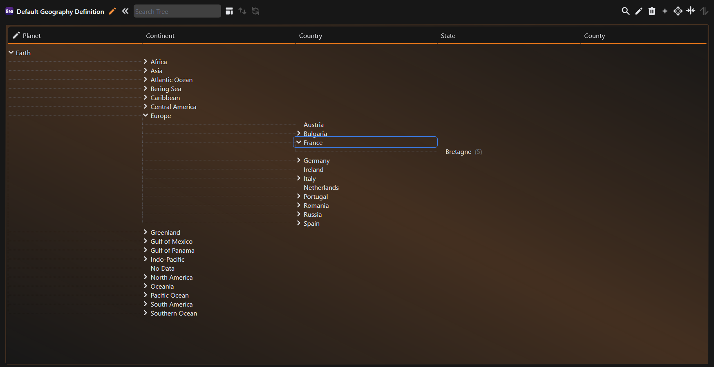
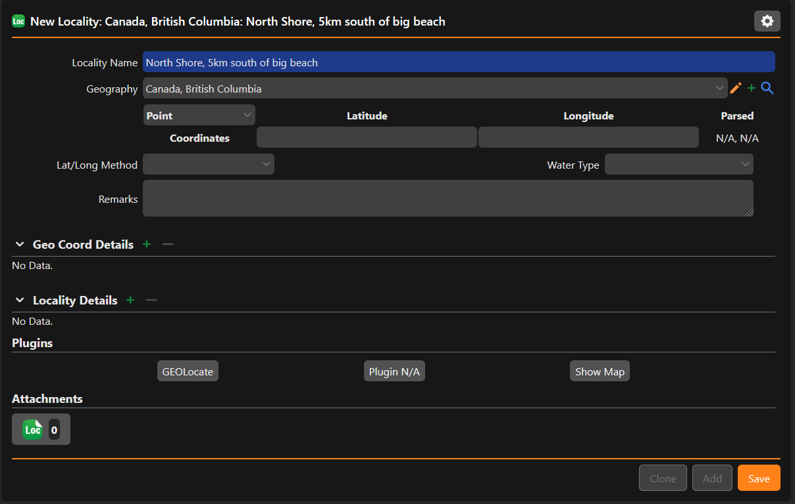

# Structuring a Locality

In Specify and in Darwin core, a location is split into two main parts.

1. An unstructured string which represents the specific details of a place

    - "Top of Cyprus Mountain"
    - "UBC Campus"

2. A structured component which fits into a formal geography tree.

    - "North America, Canada, British Columbia"
    - "Europe, United Kingdom, England"

This page will explain how to combine these two components to create localities in Specify.

## The Geography Table

The Geography table is linked to the Locality table. Localities exist within a certain Geography.

Geography is organized in a tree structure, similar to how taxonomy is arranged. Countries exist as children of continents, and states and provinces exist as children of countries.

<figure markdown>
  
  <figcaption>The Geography tree. Screenshot from demo database.</figcaption>
</figure>

## The Locality Table

The Locality table is for the specifics of a place, most importantly the name. Additional details like coordinates and elevation are also added here. When creating a locality from a label, it is best to place it under an appropriate geography.

!!! example "Creating a locality from a label"

    Let's say that a label comes into the collection with the verbatim locality "North Shore, 5km south of big beach, British Columbia". To create a locality from this, the formal component should be placed in the geography tree. Typing in "British Columbia" into the Geography queryComboBox will fill in the higher levels (North America, Canada) automatically.

    <figure markdown>
    
    <figcaption>Creating a locality with a linked geography. Screenshot from demo database.</figcaption>
    </figure>

!!! tip

    The locality name and geography will appear together on the record. The bold text at the top of the locality entry form is a preview of what it will look like. 
    In the example above, we can see this text reads **Canada, British Columbia; North Shore, 5km south of big beach**

## Why does separating geography into its own table matter?

When searching for all records from a particular place, it can be helpful to search on a geography instead of the locality name. As they are defined in a tree, there are a limited number of items for the user to pick from. It also helps to standardize spelling, eliminating variations in how a province or county may be written, further aiding search. Geographies are also parsed far better by data aggregators such as GBIF when they are standardized in this way, and tools that help detect errors in coordinate pairs use the standardized geographical information.

