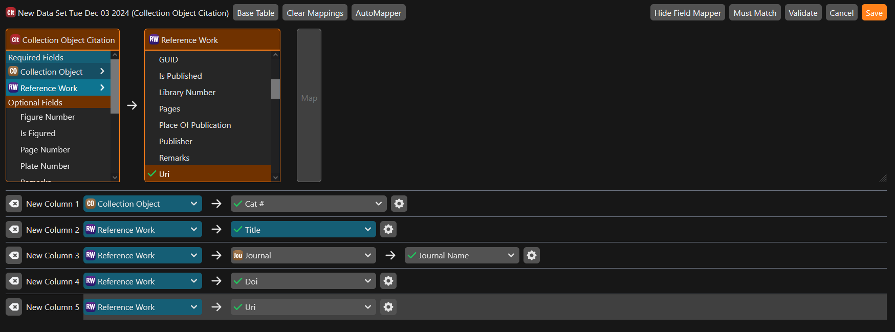
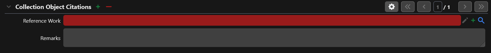

# Attach Citations to Collection Objects

If a scientific paper or thesis has been written, and references one of the objects in the collection, it can be helpful to link information about that citation to the Collection Object. This can either be done in bulk or on a record by record basis.

## Linking citations in bulk through the workbench

<iframe src="https://player.vimeo.com/video/668792569?badge=0&amp;autopause=0&amp;player_id=0&amp;app_id=58479" frameborder="0" allow="autoplay; fullscreen; picture-in-picture; clipboard-write" style="position:absolute;top:0;left:0;width:100%;height:100%;" title="Collection Object Citations"></iframe>

 [Specify Collection Consortium](https://specifysoftware.org)

Since citations have a many-to-one relationship with Collection Objects, they can be added and linked easily through the workbench. To get started, prepare a spreadsheet that has the `Catalog Number` of the record you want to link to in the leftmost corner, and then the details about the citation in the other columns. Your table might look something like the one below.

| Catalog Number | Title | Journal | DOI | URL |
| -------------- | ----- | ------- | --- | --- |
| M000001 | Foxes don't jump over logs as frequently when the sun is shining | Journal of Funny Examples | https://doi.org/10.1000/182 | https://example.com |

!!! info 

    If you have not already gone through the [Workbench Tutorial](../tutorials/workbench.md), please go through that before continuing below. 

Now with the sheet prepared, select `Collection Object Citation` when asked for a base table in the workbench. Your mapping might look something like this if you were using the columns in the table above. Note how the first column (the catalog number) fulfils the required field in the Collection Object table. The workbench needs to know which Collection Object to link the citation to.

<figure markdown>
  
  <figcaption>A possible mapping for uploading citations. Screenshot from demo database</figcaption>
</figure>

## Adding citations individually through the data entry form

If you would rather add citations to records individually, you can do that as well. The combobox for linking the citation will be under a heading similar to what is shown below.

<figure markdown>
  
  <figcaption>Under Collection Object Citations, there should be a section that looks like this</figcaption>
</figure>

If you have already entered the title of the paper before, you can type it into the search box and it should be suggested. If not, click on the green :material-plus: icon and fill out all of the details, clicking `Save` when you are done.