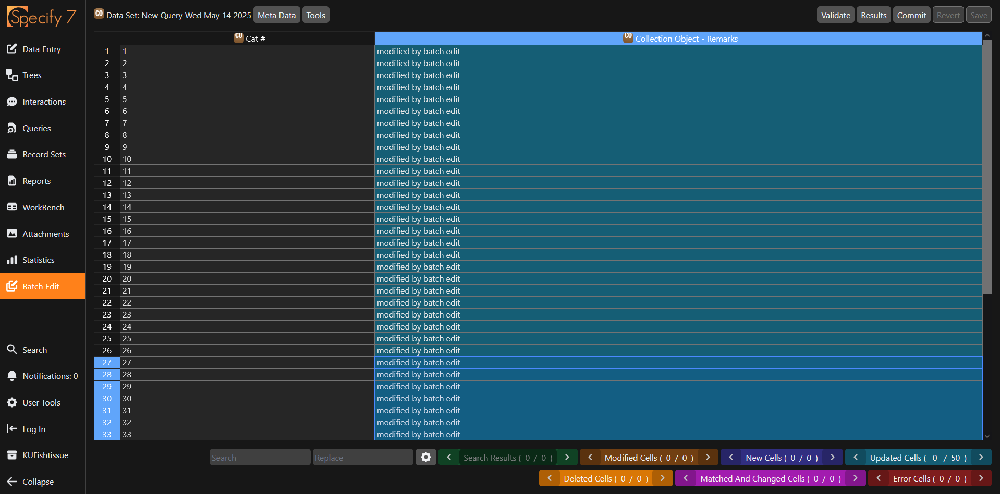

Batch Editing allows many records to be modified at once. The records to modify first must be assembled via a [query](../tutorials/queries.md), and then opened in the [workbench](../tutorials/workbench.md) interface[^1]. From that interface, edits are made by modifying the content of cells, validating, and committing.

## Query for records to modify

First, you must query for records that you wish to modify. For this example, we will look to modify every record with a catalog number between 0-50 to have "modified by batch edit" in the Collection Object remarks field.

<figure markdown>
  
  <figcaption>A query to find all Collection Objects with Catalog Number between 0 and 50. Screenshot from the demo instance.</figcaption>
</figure>

This will return 50 records in the results, none of which currently have a value in the remarks field. Notice that there is a `Batch Edit` button above the results.

<figure markdown>
  
  <figcaption>The results of the above query. Screenshot from the demo instance.</figcaption>
</figure>

## Open the batch editor

Press the `Batch Edit` button to open up the results of the query in the workbench interface. You will be asked if you want to leave the page, you should hit `Leave` unless you anticipate using the same query again.

Once the records are open in the workbench, simply click on a cell and being typing to edit the value. The cell will appear orange once edited.

!!! tip

    Similar to excel, you can drag from the bottom right-hand corner of a cell to fill its contents to other cells.

<figure markdown>
  
  <figcaption>Simply type to edit a cell. Screenshot from the demo instance.</figcaption>
</figure>

After you have made the edits you would like to make, press `Save` to save your changes.

!!! warning 

    Saving will not commit your edits to the database. Rather, this is saving the changes you have made to the dataset. This is similar to the workbench, in which saving does not upload the results.

## Validating and checking

It is *very* important to go through some checks to make sure that what you are doing aligns with the edits you would like to make. The first step is to validate the results by pressing `Validate`. 

<figure markdown>
  
  <figcaption>Cells will be colour-coded based on whether data was modified or deleted. Screenshot from the demo instance.</figcaption>
</figure>

Next, you can press `Results` to get information about which tables are going to be modified, and how many records were modified in those tables.

### Errors

Similar to the workbench, Specify will highlight errors and prevent you from committing until those errors are resolved. For example, if you remove the catalog number entirely, you will receive an error because catalogue number is required.

<figure markdown>
  
  <figcaption>Error cells will be highlighted in red after validation. Screenshot from the demo instance.</figcaption>
</figure>

## Committing

Committing is the moment when data is actually saved to the database. You have "committed" to making the edits. Before committing, you should have validated the data, ensured there were no errors, and double checked to be sure of all the edits you would like to make.

Click `Commit` to commit the data. After successfully committing, the dataset will become read-only, exactly the same as the workbench.

[^1]: Although the interface is the same, it is important to keep in mind that the Workbench datasets are kept separate from the batch editing datasets. You cannot batch edit directly from the workbench.