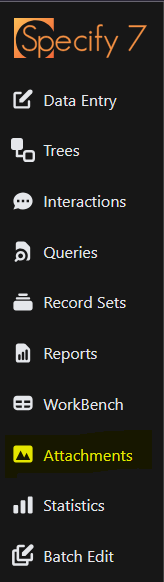
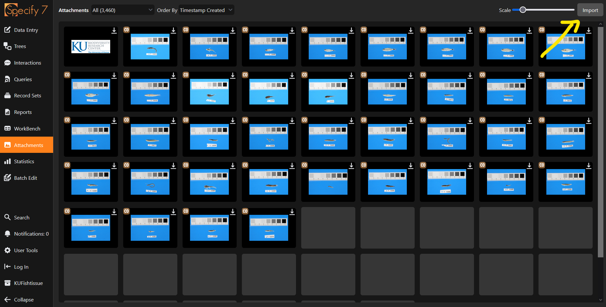
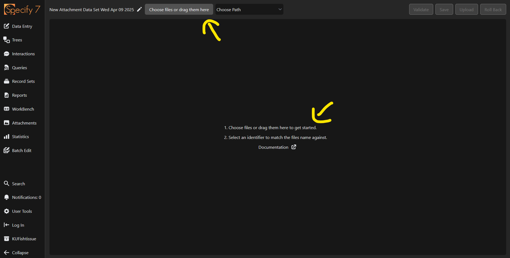

Specify allows the user to upload images en masse (hundreds at a time). This can be useful when used in combination with an imaging station, or when uploading specimen images that have been provided by a researcher.

## Navigating to the attachments interface

The first step to batch uploading images is navigating to the Attachments section through the navigation menu

<figure markdown>
  
  <figcaption>Navigate to the the attachments page from the homescreen</figcaption>
</figure>

After navigating to the Attachments page, select `Import` in the top right corner.

<figure markdown>
  
  <figcaption>The import button on the attachments page. Screenshot from demo instance</figcaption>
</figure>

A popup will appear for Attachment Data Sets. To upload new images, click the `New` button. Name the dataset anything that makes sense to you. 

## Adding files

From the attachment importer, either drop image files into the rectangle in the center of the page, or click `Choose files or drag them here`.

<figure markdown>
  
  <figcaption>Add files to the importer by clicking the button or dragging and dropping. Screenshot from demo instance</figcaption>
</figure>

## Matching files to a record

The easiest way to match images to a specimen is to have the catalog number in the filename itself. For example, `V000001.tif`. Specify will automatically detect the matching Catalog number.

From the top navigation, select `Choose Path` and then `Collection Object / Catalog Number` [^1]. Here, you are telling Specify which field to match against in the database.

!!! warning "When uploading multiple images for the same record"

    Uploading multiple images attached to the same collection object is possible, however, **the catalog numbers must be formatted exactly**. For example, `V000001a.tif` and `V000001b.tif` would work, `V1a.tif` and `V1b.tif` would not.

## Validate and upload the data

Next, select `Validate`. The system will match the filenames with records in the database and show you which ones have been found. If you are happy with the results, click `Upload` to upload the images to Specify.

[^1]: Note that this will differ by collection. If the collection refers to catalog numbers as accession numbers, then this option will read `Collection Object / Accession Number`. 
