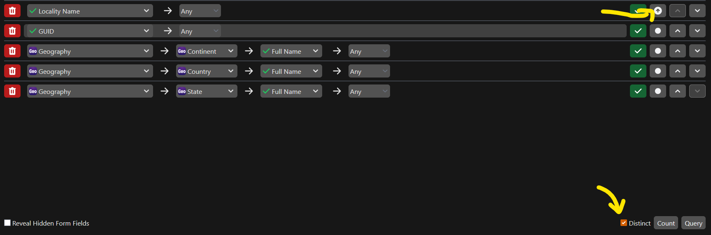
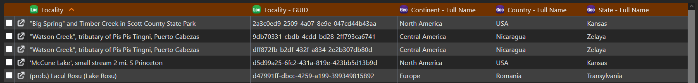
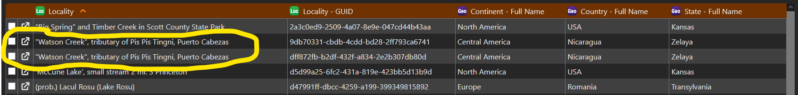
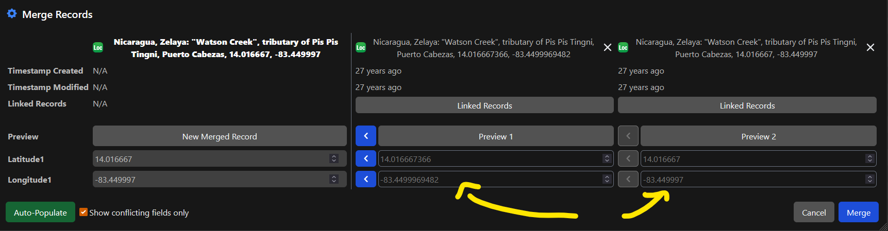

# Merge Localities

Having duplicated or similar localities in your collection can lead to lots of suggestions appearing when you are linking a Collection Object to a locality. Additionally, having only one locality for each place means that more effort can be focused on making that locality complete with details, and saves effort when georeferencing.

## Constructing a query to find all unique localities in a collection

An easy way to find similar or duplicated localities is to construct a sorted list. This can be done through a query that looks like the following.

**Query Locality table**

<figure markdown>
  
  <figcaption>Query to search for duplicate localities. Screenshot from demo database</figcaption>
</figure>

Ensure that the sorting option for `Locality Name` is set to :material-arrow-up-circle: and that `Distinct` is checked. 

The results returned will look like this 

<figure markdown>
  
  <figcaption>Results from query to search for duplicate localities. Screenshot from demo database</figcaption>
</figure>

Notice that there are two localities with the same name, and are linked to a geography with the same continent, country, and state. These are good candidates for possible duplicate localities.

<figure markdown>
  
  <figcaption>Two localities that are potential duplicates. Screenshot from demo database</figcaption>
</figure>

## Performing the merge

To merge the localities, first click on the :material-checkbox-blank-outline: next to *both* records that you want to merge. Then click `Merge Records`. This will open up the merge dialogue, which will show any differences between the two localities. Here it seems that the two longitudes are *slightly* different, but probably represent the same place. The column on the far left represents what the final record will look like after the merge. You can always manually change the values, or use the :material-chevron-left-box: button to use the value from one of the records set to be merged. Clicking on `Linked Records` will allow you to see anything that is linked to the locality.

<figure markdown>
  
  <figcaption>The merge localities popover. Screenshot from demo database</figcaption>
</figure>

Clicking `Merge` will finalize the merge.