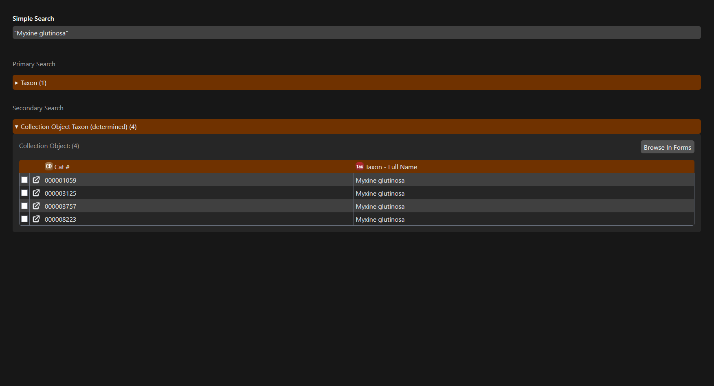
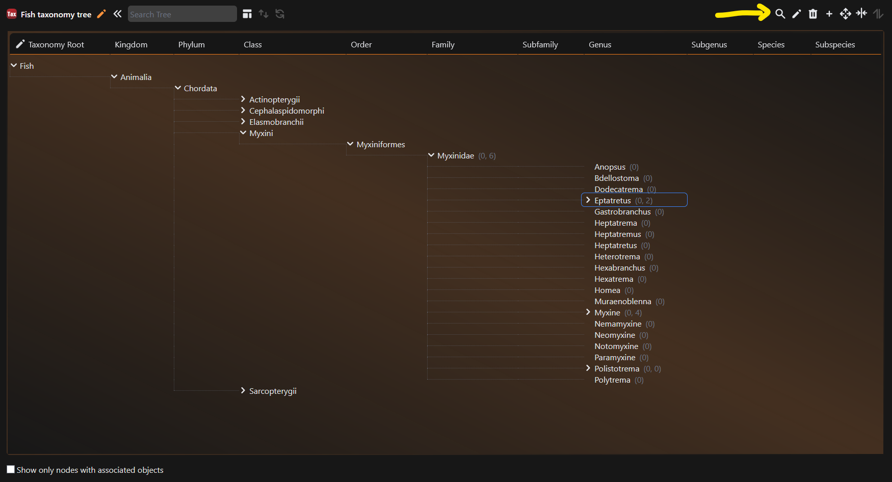

# Search for records by scientific name

There may be instances in which you want to search for all records that are identified to be part of a particular taxonomic group. If you know the genus and species name, it may be faster to use simple search. If you want to search through higher ranks and more broadly, the tree method is the better approach.

## Using Simple Search

You can use simple search to search for all Collection Objects associated with a particular Taxon. For instance, if you were interested in seeing all *Myxine glutinosa* within a collection, you could type `"Myxine glutinosa"` into the simple search box.

!!! warning "Important"

    The quotation marks around *Myxine glutinosa* are very important. This tells the system that you want to search for everything that has **both** of those terms together. Without them, you will likely not see any results.

All Collection Objects under that scientific name will appear in the Secondary search results.

<figure markdown>
  
  <figcaption>The records will appear under Secondary Search. Screenshot from the demo database</figcaption>
</figure>

From here, you can either open up the records in a new tab by pressing :material-open-in-new: or selecting the records you wish to view with the checkbox and pressing `Browse in Forms`.

## Using the Taxon Tree

As covered in [the Trees tutorial](../tutorials/trees.md), the records associated with any given taxonomic node can be queried by pressing the :material-magnify: icon in the top right corner, after selecting which node you would like to view.

<figure markdown>
  
  <figcaption>Query from a node in the taxon tree. Screenshot from the demo database</figcaption>
</figure>

Unlike searching via simple search, this will return all records associated with either that node, *or its children*. Thus, querying on Phylum will lead to broader results than querying on a species node.
