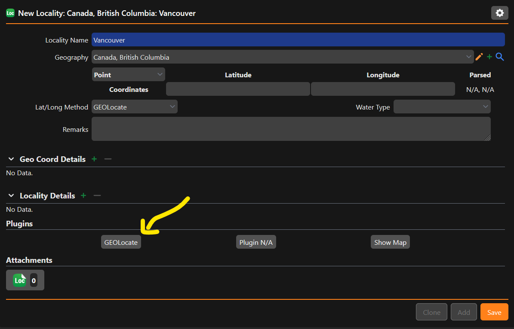
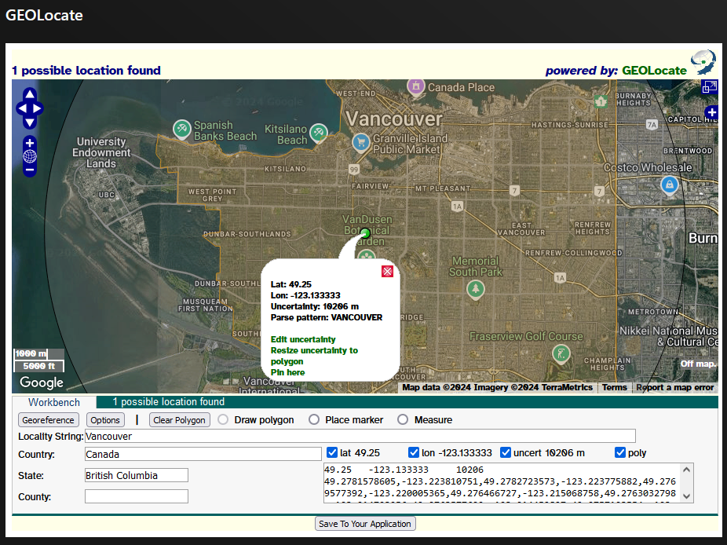

# Use geolocate to find coordinates for a locality

Geolocate enables you to search for the coordinates of a locality via it's name and geography. It is a quick and easy way to add coordinates to data.

## Information required

In order to georeference a locality, the following pieces of information are required as input:

### For localities within the United States of America

| Field | Data needed? |
| ----- | ----------- |
| Locality Name | :material-check: |
| Country | :material-check: |
| State | :material-check: |
| County | Recommended |

### For localities outside of the United States of America

| Field | Data needed? |
| ----- | ----------- |
| Locality Name | :material-check: |
| Country | :material-check: |
| Node below country | Recommended |

## Using geolocate from the locality form

After entering in the required information above into the appropriate form fields, press `GEOLocate` under the Plugins section. It is also suggested to select `GEOLocate` as the Lat/Long method, as this lets others know that GEOLocate was used to determine the coordinate location when the data is published.

<figure markdown>
  
  <figcaption>Using the Geolocate plugin from the locality form</figcaption>
</figure>

After clicking the `GEOLocate` button, a popover will appear.

<figure markdown>
  
  <figcaption>Geolocate plugin</figcaption>
</figure>

From here, you may edit the information in the fields directory, or use the cursor to drag the coordinate around, or edit the size of the uncertainty radius. Click `Save To Your Application` to automatically add the details into the Specify locality.