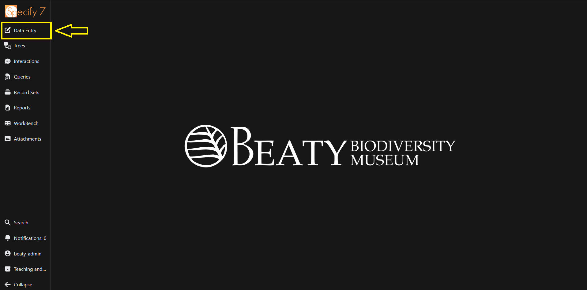
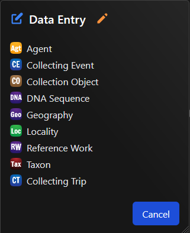
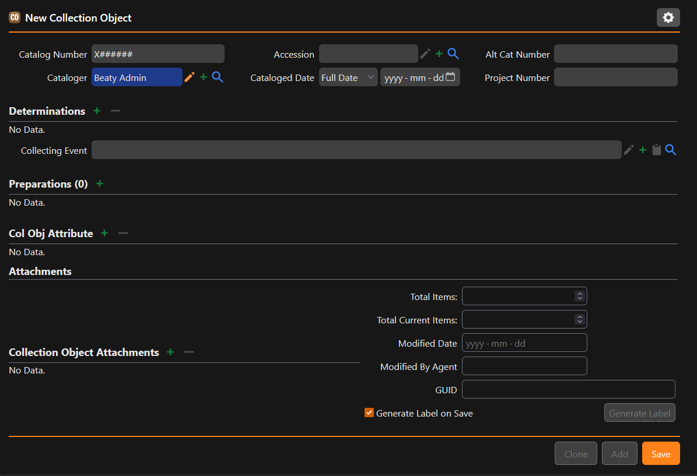

# Getting Started

Specify is the Collection Management System (CMS) for the museum, and is where all data about specimens is stored. Specify can be accessed anywhere through your browser, and does not require any software to be installed.

[Go to Specify](https://database.beatymuseum.ubc.ca){ .md-button }

## Learning Objectives

By the end of this page, you will:

- [ ] Understand key concepts within Specify and how to use basic terminology to describe elements of the system.
- [ ] Grasp how Specify differs from other CMS systems, and the relational database model that Specify uses.
- [ ] Have the skills to enter data into a table using the `Data Entry` process.

## Definitions and Key Concepts

`Collection Object`

:   A collection object is a record. It represents something collected by a particular person or group, at a particular time, in a particular place.

`Agent`

:   An agent is either a person or a group of people that perform some action within the system. All users have an assigned Agent which represents them in the system.

`Collecting Event`

:   The details about a time and place in which something was collected.

`Determination/Identification`

:   The taxonomic identification of a Collecting Object. For example, this specimen has been identified as *Vulpes vulpes* (red fox).

`Preparation`

:   The physical "thing(s)" that make up a Collection Object. For example, the skull of a fox.

`Tree`

:   There are multiple concepts that exist in a hierarchial structure. Geography, for example, consists of Continents > Countries > States/Provinces. Specify organizes such information in trees, and these trees can be searched and edited.

`Catalog Number`

:   Each Collection Object has a unique Catalog Number within each collection. These always take the form `[A-Z]#######`, where `[A-Z]` is a single capital letter that differs by collection.

`Query`

:   The way to search for things within the Database. They can be simple, or complex.

!!! quote ""

    - [x] Understand key concepts within Specify and how to use basic terminology to describe elements of the system

## The Relational Data Model

Specify may differ from other CMS tools you have used before. At the core of Specify is an SQL database. You don't need to know anything about SQL to use Specify, but it does help to understand how relational databases work!

In a relational database, records in a table can have a _relationship_ to another record in a different table. Let's start off with a simple example:

``` mermaid
classDiagram
  CollectionObject : +String catalogNumber
  CollectionObject : +String dateCreated
  CollectionObject : +String GUID
  Agent <-- CollectionObject: created by
  class Agent{
    +String firstName
    +String lastName
    +String type
    +Date dateCreated
  }
```

As covered previously, all of the information about people is stored in the Agents table. People _do_ things, such as create Collection Objects, determine which taxon something fits under, or collect specimens in the field. We want this to be reflected in the relationship to other tables so that there is a full picture of who a person or organization is, rather than just a single field describing everything.

### What is a Schema?

There are many more relationships and tables than the simple example above. A schema maps out all the tables and relationships in a database. You can reference the schema if you are ever unsure about a particular table or field. 

The schema for Specify is pretty stable, but does change on occasion.

[Go to Schema](https://files.specifysoftware.org/schema/version/2.10/){ .md-button }

!!! quote ""

    - [x] Grasp how Specify differs from other CMS systems, and the relational database model that Specify uses

## Entering Data

!!! note

    In depth documentation for this topic can be found [here](https://discourse.specifysoftware.org/t/data-entry-in-specify/960)

You now have the skills necessary to begin entering data. To enter data, click on "Data Entry" in the navigation menu. Next, you will be presented with a popup that asks which table you would like to enter data into:

<figure markdown>
  
  <figcaption>Accessing Data Entry from the homescreen</figcaption>
</figure>

<figure markdown>
  
  <figcaption>The Data Entry popup modal</figcaption>
</figure>

For now, let's start by selecting `Collection Object`. This is the main table that you will be entering data into 90% of the time.

Next, you will be presented with a form that has been customized for the collection that you are in, and has all of the fields used by the collection for you to enter data into. Some of the fields may not be immediately visible on the base form, and require expanding sections or opening up subforms. As each form is unique, there may be a small learning curve to get to know where all fields are for your collection. For an overview of the major tables in Specify and their purpose, you can refer to the [reference information](../../reference/index.md) on this documentation site.

<figure markdown>
  
  <figcaption>The Data Entry form for the fish collection</figcaption>
</figure>

Each of the fields on this form will not be covered on this page. Instead, the general concept on how the Collection Object form acts as the root of data entry will be explained.

### Forms and Subforms

**A form represents a way to enter data into specific fields, in a specific table.** In the case of the Collection Object form, any of the fields at the top of the form are fields directly in the Collection Object table. This is not a technical rule from the Specify software, rather, a convention used at Beaty.

A subform represents a way to enter data into another form, and link it to a Collection Object. For example, in the fish example presented above, we have the option of entering Determination information by clicking on the green :material-plus: icon beside "Determinations".

<figure markdown>
  
  <figcaption>Accessing a subform from the Collection Object form</figcaption>
</figure>

<figure markdown>
  
  <figcaption>The expanded Determination Subform</figcaption>
</figure>

When you enter data into this subform, it is being entered into the `Determinations` table, with a link to the `CollectionObject` table. This link is created automatically in the system, you do not need to manually link anything as the user. A visualization of this is displayed below:

```mermaid
graph LR
    A[Collection Object] ---> B[Determination];

```

You may notice that after hitting the green :material-plus: icon, you can hit the same green :material-plus: icon again. This is because the relationship between a Collection Object and many other tables, is _one-to-many_. A single Collection Object can have one or more Determinations. This is also shown through the 1/1 UI component. Once you have entered more than one Determination, you can cycle through them using the arrow buttons.

```mermaid
graph LR
    A[Collection Object] ---> B[Determination];
    A[Collection Object] ---> C[Determination];
    A[Collection Object] ---> D[Determination];

```

In _one-to-many_ relationships in which there is one record that should be taken as the source of truth, Beaty uses a checkbox system in Specify, in which the record that is authoritative will be checked and all others of the same table will not be. In the figure above, this would be the "Current" checkbox.

!!! example

    Try entering the following information into the form for the Collection Object

    Collection Object:

      * catalogNumber: Ask your Collection Curator which number should be used for learning purposes
      * remarks: Leave a remark saying "I know how to enter data!"

    Next, let's add a determination

    Determination:

      * taxon: Pick a genus + species combination you know to be in the collection and begin typing it into the taxon field. You should see the taxon be suggested after typing enough letters! Click on the taxon after it appears in the dropdown to select it.

### Saving data

After entering values into fields, __you will need to manually save the record__. There is no autosave functionality. To save the record, press the `Save` button in the bottom right of the form.

!!! quote ""

    - [x] Have the skills to enter data into a table using the `Data Entry` process.

*[CMS]: Collection Management System
